# 🎬 TomFlix App - FATEC

Projeto acadêmico de desenvolvimento web estruturado em contêineres Docker, simulando uma plataforma de streaming. O sistema evoluiu de uma arquitetura monolítica (Atividade 1) para uma arquitetura baseada em microsserviços com comunicação em rede interna (Atividade 2).

---

## 📌 Atividade 1: Estruturação Inicial e Banco de Dados

Nesta primeira etapa, o objetivo foi construir a interface principal da aplicação (Catálogo) e integrá-la a um banco de dados relacional (MariaDB) utilizando o FastAPI.

### Funcionalidades Implementadas
* Construção da interface com HTML/CSS (Jinja2).
* Modelagem do banco de dados (Tabelas: Usuários, Favoritos, Comentários).
* Integração com a API externa do TheMovieDB.
* Conteinerização do banco de dados e da aplicação principal via `docker-compose`.

### Evidências Visuais (Atividade 1)

**1. Tela de Login e Cadastro (Visual Dark Mode):**
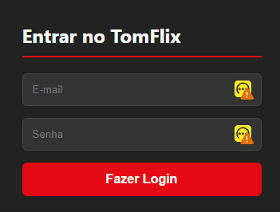

**2. Catálogo de Filmes e Integração TMDB:**
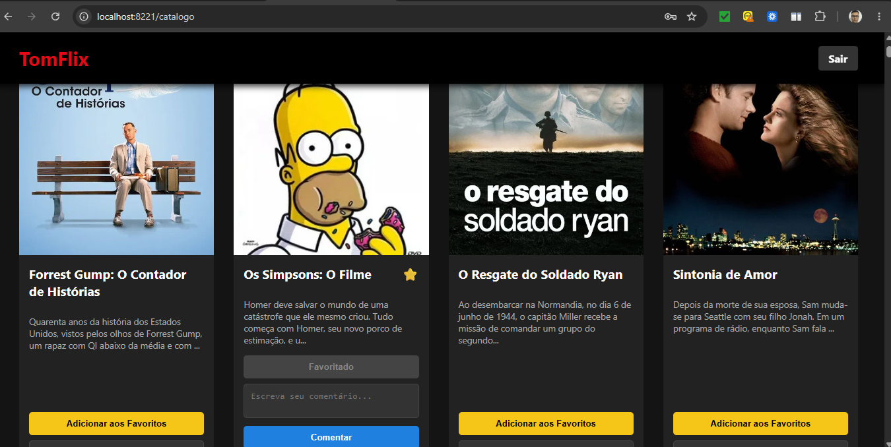

**3. Tabela de Usuários no Banco de Dados:**
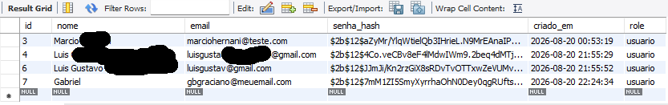

---

## 🔒 Atividade 2: Microsserviços e Recuperação de Senha

Nesta segunda etapa, a arquitetura foi refatorada para isolar a responsabilidade de segurança. O acesso ao banco de dados para login e cadastro foi removido do Catálogo e transferido para um Microsserviço de Autenticação isolado.

### Funcionalidades Implementadas
* **Microsserviço de Autenticação:** Contêiner isolado rodando na porta interna 3000, invisível para a internet.
* **Comunicação Interna:** O Catálogo agora atua como proxy, enviando requisições HTTP (`requests`) para o microsserviço.
* **Recuperação de Senha Segura:** Geração de Tokens UUID únicos no banco de dados com limite de expiração ($\Delta t = 30 \text{ min}$).
* **Serviço de E-mail (SMTP):** Integração com o Mailtrap para disparo de links de redefinição de senha em ambiente de testes.
* **Sistema de Notificações (UX):** Redirecionamento inteligente com Flash Messages (Toasts) dinâmicas e coloridas na tela inicial.

### Evidências Visuais (Atividade 2)

**1. Recebimento do E-mail de Recuperação (Mailtrap):**
*Comprova a comunicação do microsserviço com o servidor SMTP através da porta 587.*
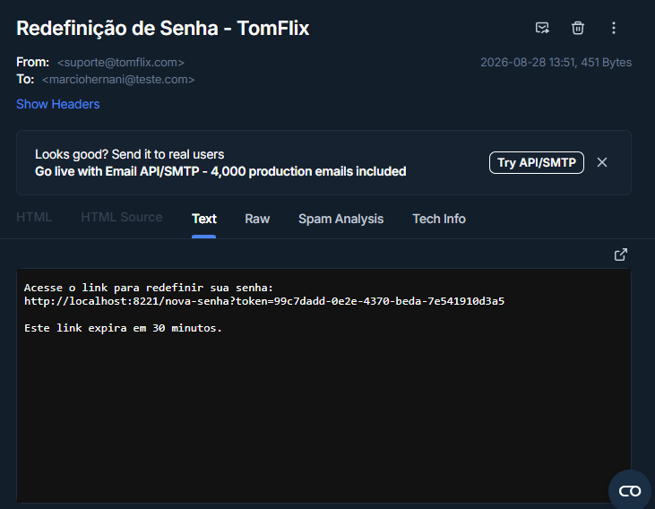

**2. Tela de Redefinição de Senha:**
*Interface padronizada que injeta o token temporal oculto.*
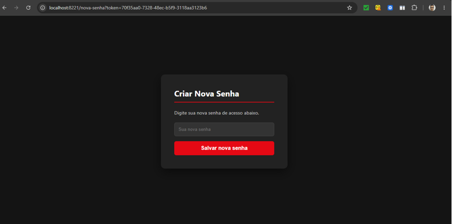

**3. Validação de Segurança (Token Expirado/Inválido):**
*Comprova que o sistema recusa a reutilização de links, exibindo alerta vermelho dinâmico.*
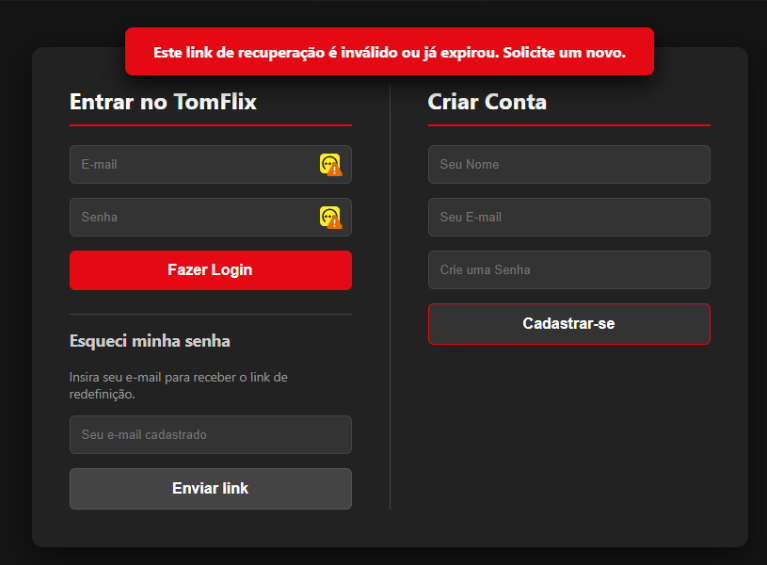

**4. Notificação de Sucesso:**
*Comprova a sincronização do backend com a interface, exibindo alerta verde após a troca da senha.*
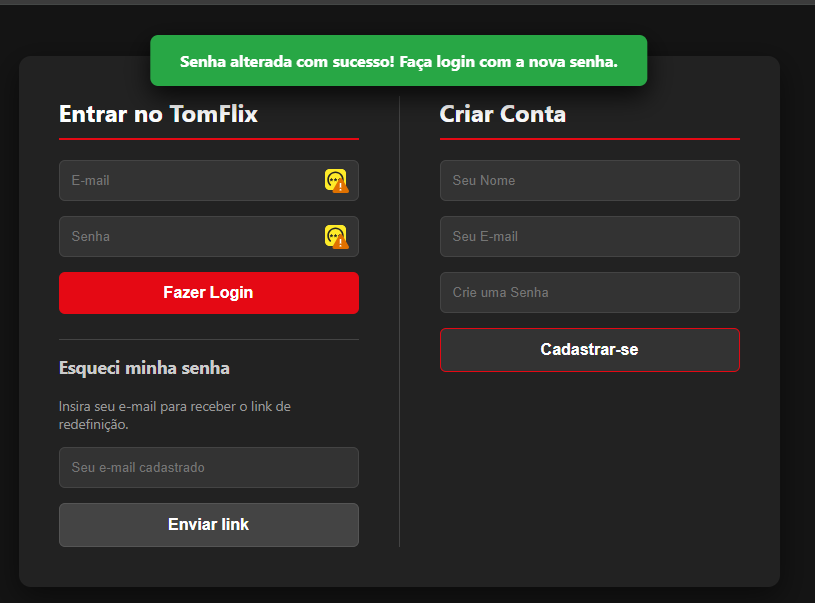

---

## 🛡️ Atividades 3 e 4: Autenticação, Autorização e RBAC

Nestas etapas, o sistema evoluiu para identificar quem é o usuário (Autenticação) e definir exatamente o que ele tem permissão para fazer (Autorização). A segurança foi aplicada diretamente no servidor (backend), impedindo que manipulações na interface burlem as regras de negócios.

### Funcionalidades Implementadas

*   **Identidade e Sessão:** O Catálogo agora captura e exibe o nome e o papel (`role`) do usuário logado no cabeçalho.
*   **Controle de Acesso Baseado em Papéis (RBAC):**
    *   **Papel `usuario`:** Pode visualizar o catálogo, favoritar filmes, fazer comentários e apagar *apenas* os seus próprios comentários.
    *   **Papel `admin`:** Possui todas as permissões acima, com a adição exclusiva de **Moderação**, podendo apagar o comentário de qualquer usuário da plataforma.
*   **Enforcement Centralizado:** A validação real de permissão acontece no backend (API). Se um usuário comum forçar uma requisição de exclusão, o servidor recusa a ação imediatamente.
*   **Renderização Dinâmica (Jinja2):** O botão de exclusão de comentários é injetado no HTML apenas se o usuário tiver os privilégios necessários.

### Requisito 5: Arquitetura de Autorização
O microsserviço deste projeto utiliza o **Padrão A — Enforcement centralizado**. 
Toda ação sensível verifica o papel atual do usuário no momento da requisição, validando as informações diretamente com a sessão e o banco de dados. 

**E se usássemos o Padrão B (Claims no JWT)?**
Se a arquitetura fosse alterada para o Padrão B, o papel do usuário (`role`) viria assinado dentro do próprio token de login. A principal mudança no código seria a remoção das consultas extras ao banco para validar o nível de acesso, substituindo-as por uma função de decodificação do JWT. A vantagem seria o ganho de velocidade (menos requisições ao banco), mas a desvantagem seria a dificuldade de revogação imediata: se um `admin` fosse rebaixado a `usuario`, ele continuaria com poderes de moderação até que o seu token expirasse.

### Evidências Visuais (Atividades 3 e 4)

**1. Visão do Usuário Comum:** *O botão de moderação (Apagar) não é renderizado em comentários de terceiros.*
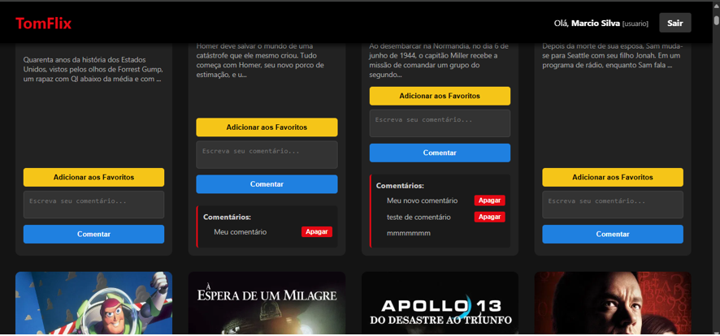

**2. Visão do Administrador (Moderação):** *O botão de moderação está disponível globalmente e a exclusão é efetuada com sucesso.*
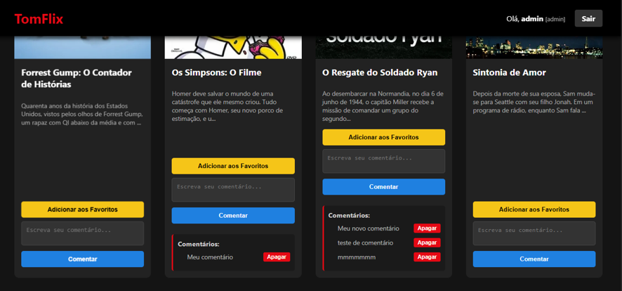
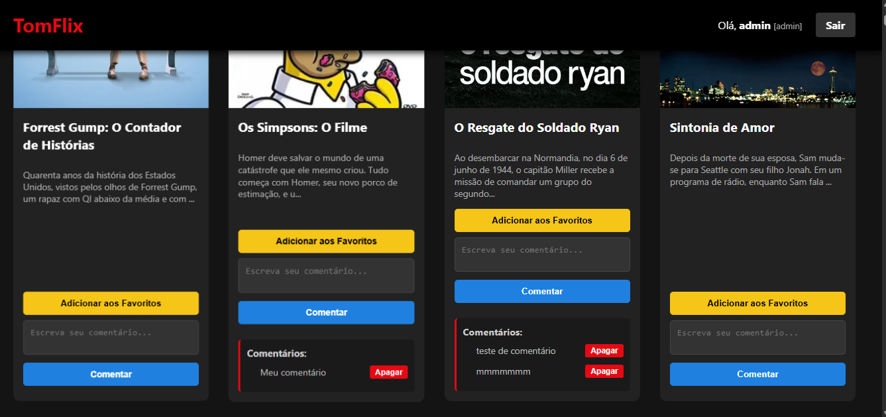

**3. Enforcement no Backend (Proteção 403):** *Comprova que o servidor bloqueia e retorna erro "403 Forbidden" caso um usuário tente forçar a rota de exclusão de terceiros.*
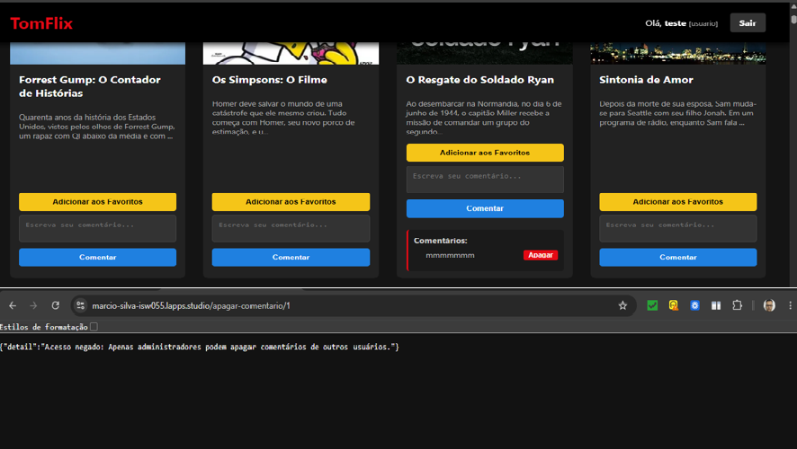

---
*Desenvolvido por Marcio Hernani - Estudante de Tecnologia em Sistemas Inteligentes*
---
*Disciplina: Computação em Nuvem - Professor Me. Allan L. R. Siriani* - (@siriani).
