# 🎬 TomFlix App - FATEC

Projeto acadêmico de desenvolvimento web estruturado em contêineres Docker, simulando uma plataforma de streaming. O sistema evoluiu de uma arquitetura monolítica (Atividade 1) para uma arquitetura baseada em microsserviços com comunicação em rede interna (Atividade 2).

---

## 📌 Atividade 1: Estruturação Inicial e Banco de Dados

Nesta primeira etapa, o objetivo foi construir a interface principal da aplicação (Catálogo) e integrá-la a um banco de dados relacional (MariaDB) utilizando o FastAPI.

### Funcionalidades Implementadas
* Construção da interface com HTML/CSS (Jinja2).
* Modelagem do banco de dados (Tabelas: Usuários, Favoritos, Comentários).
* Integração com a API externa do TheMovieDB.
* Conteinerização do banco de dados e da aplicação principal via `docker-compose`.

### Evidências Visuais (Atividade 1)

**1. Tela de Login e Cadastro (Visual Dark Mode):**
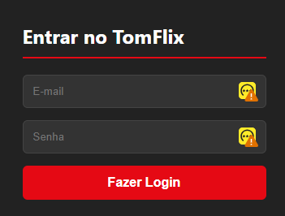

**2. Catálogo de Filmes e Integração TMDB:**
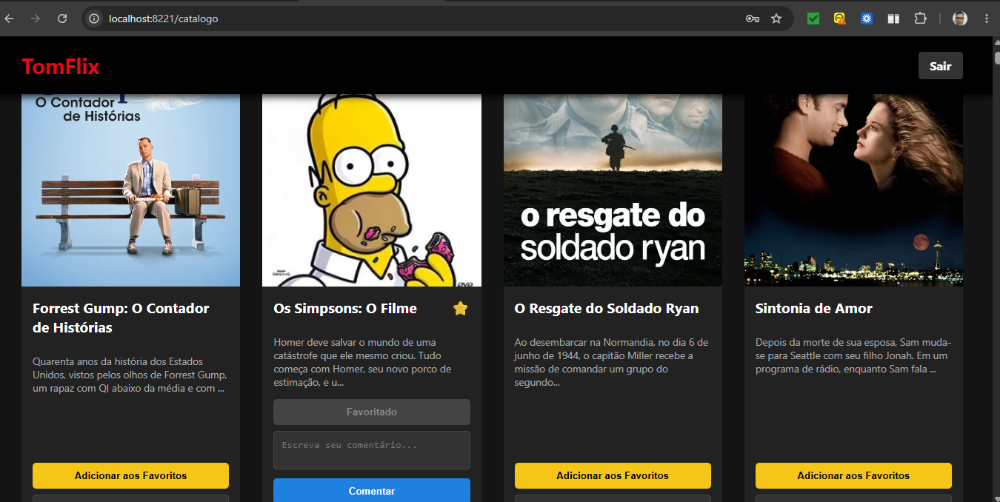

**3. Tabela de Usuários no Banco de Dados:**
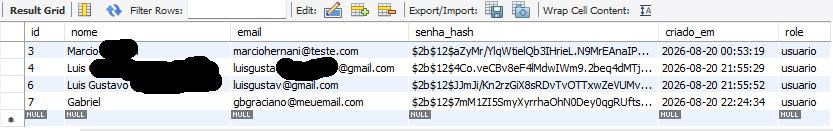

---

## 🔒 Atividade 2: Microsserviços e Recuperação de Senha

Nesta segunda etapa, a arquitetura foi refatorada para isolar a responsabilidade de segurança. O acesso ao banco de dados para login e cadastro foi removido do Catálogo e transferido para um Microsserviço de Autenticação isolado.

### Funcionalidades Implementadas
* **Microsserviço de Autenticação:** Contêiner isolado rodando na porta interna 3000, invisível para a internet.
* **Comunicação Interna:** O Catálogo agora atua como proxy, enviando requisições HTTP (`requests`) para o microsserviço.
* **Recuperação de Senha Segura:** Geração de Tokens UUID únicos no banco de dados com limite de expiração ($\Delta t = 30 \text{ min}$).
* **Serviço de E-mail (SMTP):** Integração com o Mailtrap para disparo de links de redefinição de senha em ambiente de testes.
* **Sistema de Notificações (UX):** Redirecionamento inteligente com Flash Messages (Toasts) dinâmicas e coloridas na tela inicial.

### Evidências Visuais (Atividade 2)

**1. Recebimento do E-mail de Recuperação (Do Sandbox à Produção):**
*Comprova a comunicação inicial do microsserviço via sandbox (Mailtrap) e a evolução para disparo transacional real em produção via servidor SMTP do Brevo (`smtp-relay.brevo.com` na porta `587` com `STARTTLS`), utilizando `MIMEMultipart` para renderização de e-mail estilizado em HTML com botão de ação.*
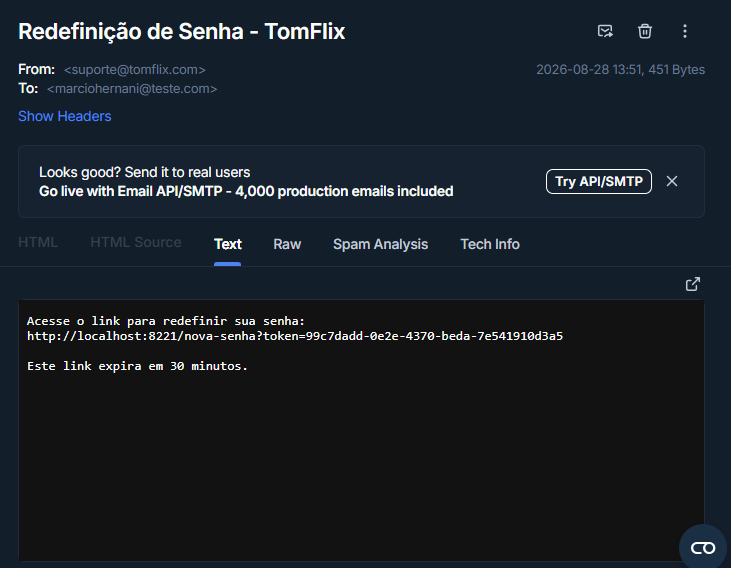
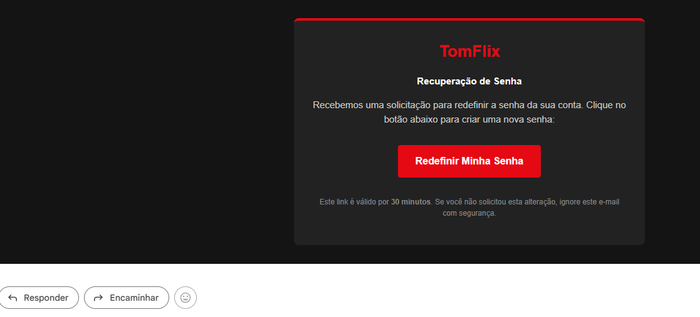

**2. Tela de Redefinição de Senha:**
*Interface padronizada que injeta o token temporal oculto.*
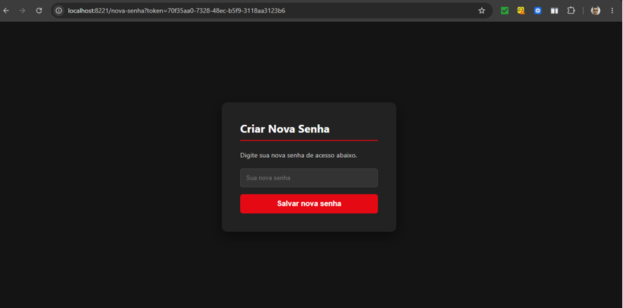

**3. Validação de Segurança (Token Expirado/Inválido):**
*Comprova que o sistema recusa a reutilização de links, exibindo alerta vermelho dinâmico.*
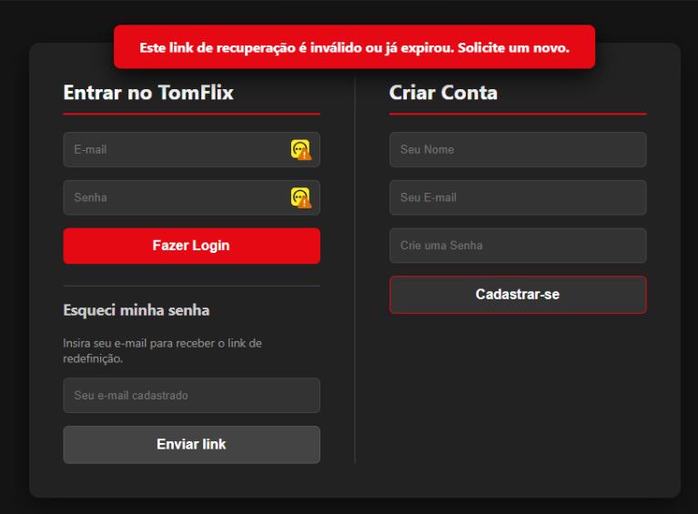

**4. Notificação de Sucesso:**
*Comprova a sincronização do backend com a interface, exibindo alerta verde após a troca da senha.*
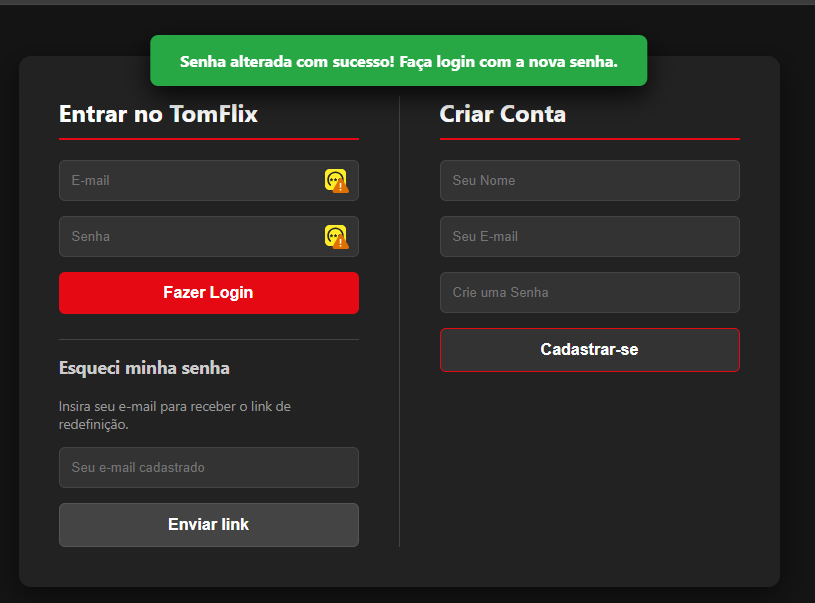

---

## 🛡️ Atividades 3 e 4: Autenticação, Autorização e RBAC

Nestas etapas, o sistema evoluiu para identificar quem é o usuário (Autenticação) e definir exatamente o que ele tem permissão para fazer (Autorização). A segurança foi aplicada diretamente no servidor (backend), impedindo que manipulações na interface burlem as regras de negócios.

### Funcionalidades Implementadas

*   **Identidade e Sessão:** O Catálogo agora captura e exibe o nome e o papel (`role`) do usuário logado no cabeçalho.
*   **Controle de Acesso Baseado em Papéis (RBAC):**
    *   **Papel `usuario`:** Pode visualizar o catálogo, favoritar filmes, fazer comentários e apagar *apenas* os seus próprios comentários.
    *   **Papel `admin`:** Possui todas as permissões acima, com a adição exclusiva de **Moderação**, podendo apagar o comentário de qualquer usuário da plataforma.
*   **Enforcement Centralizado:** A validação real de permissão acontece no backend (API). Se um usuário comum forçar uma requisição de exclusão, o servidor recusa a ação imediatamente.
*   **Renderização Dinâmica (Jinja2):** O botão de exclusão de comentários é injetado no HTML apenas se o usuário tiver os privilégios necessários.

### Requisito 5: Arquitetura de Autorização
O microsserviço deste projeto utiliza o **Padrão A — Enforcement centralizado**. 
Toda ação sensível verifica o papel atual do usuário no momento da requisição, validando as informações diretamente com a sessão e o banco de dados. 

**E se usássemos o Padrão B (Claims no JWT)?**
Se a arquitetura fosse alterada para o Padrão B, o papel do usuário (`role`) viria assinado dentro do próprio token de login. A principal mudança no código seria a remoção das consultas extras ao banco para validar o nível de acesso, substituindo-as por uma função de decodificação do JWT. A vantagem seria o ganho de velocidade (menos requisições ao banco), mas a desvantagem seria a dificuldade de revogação imediata: se um `admin` fosse rebaixado a `usuario`, ele continuaria com poderes de moderação até que o seu token expirasse.

### Evidências Visuais (Atividades 3 e 4)

**1. Visão do Usuário Comum:** *O botão de moderação (Apagar) não é renderizado em comentários de terceiros.*
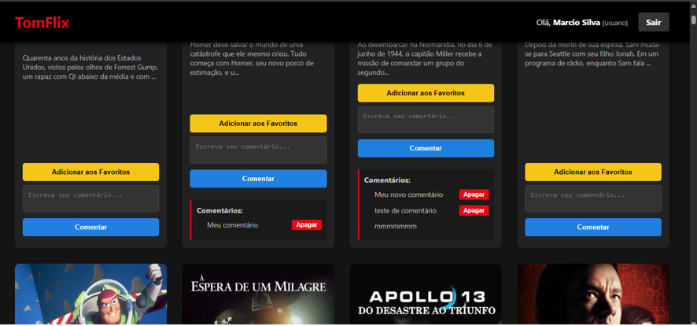

**2. Visão do Administrador (Moderação):** *O botão de moderação está disponível globalmente e a exclusão é efetuada com sucesso.*
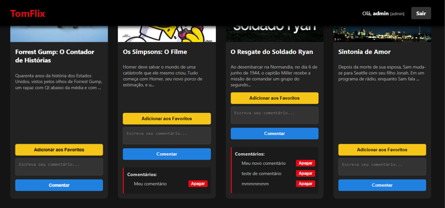
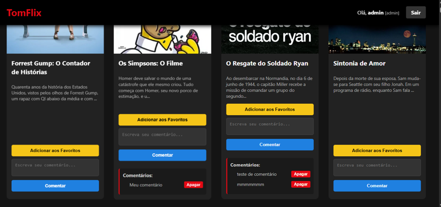

**3. Enforcement no Backend (Proteção 403):** *Comprova que o servidor bloqueia e retorna erro "403 Forbidden" caso um usuário tente forçar a rota de exclusão de terceiros.*
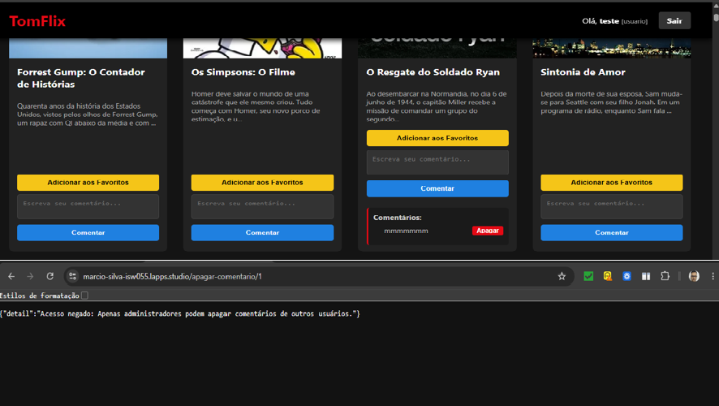

---

## 📋 Atividade 5: Trilha de Auditoria (Event Logging) com Redis

Nesta etapa, o projeto evoluiu de um registro passivo para um monitoramento ativo do comportamento dos usuários. Para não sobrecarregar o banco de dados relacional (MariaDB) com um fluxo constante de inserções, implementou-se o padrão de separação de responsabilidades (Segregation of Duties) através de um novo microsserviço apoiado por um banco em memória.

### Arquitetura e Decisões Técnicas

*   **Novo Microsserviço (`log-service`):** Um contêiner FastAPI isolado na rede interna do Docker, sem exposição de portas para o host, garantindo que logs não possam ser forjados externamente.
*   **Banco em Memória (Redis Streams):** O Redis foi escolhido por sua altíssima velocidade em operações de escrita (write-heavy). Utilizou-se a estrutura de dados `Streams` (comandos `XADD` e `XREVRANGE`), que é nativamente desenhada para logs de eventos contínuos, garantindo ordenação cronológica rigorosa (timestamping automático) que uma simples estrutura de lista (`LPUSH`) não ofereceria de forma tão eficiente.
*   **Rastreio Distribuído (Hooks):** O Catálogo e o Auth-Service atuam como produtores de eventos. Eles disparam requisições assíncronas internas relatando sucessos e falhas diretamente para o `log-service`.

### Eventos Monitorados
O sistema rastreia e armazena centralmente ações críticas, registrando *Quem*, *O que*, *Quando* e o *IP de Origem*:
- `login` e `logout`
- `favoritou_filme_{id}` / `desfavoritou_filme_{id}`
- `comentou_no_filme_{id}`
- `apagou_comentario_{id}` (Ação de moderação)
- **Segurança:** `tentativa_negada_403_*` (Gera alerta imediato sobre tentativas de violação de privilégios).

### Evidências Visuais (Atividade 5)

**1. A Nova Infraestrutura (Docker Compose):** *Comprova a adição do serviço Redis e do Log-Service operando exclusivamente na rede interna.*
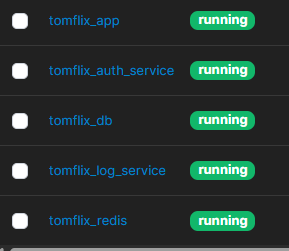

**2. Consulta de Logs (Visão do Admin):** *O endpoint protegido (`/auditoria`) exibe com sucesso o fluxo de ações dos usuários organizados cronologicamente, incluindo as interceptações de erro 403.*
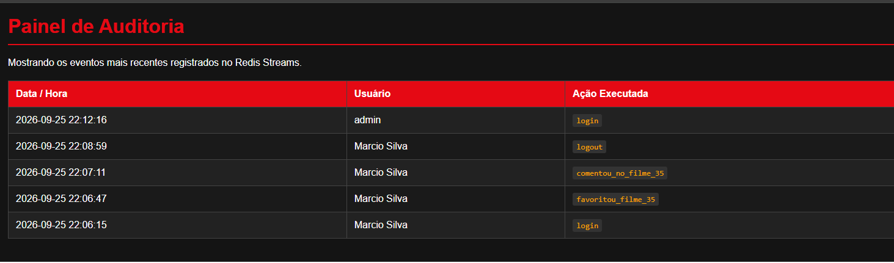

**3. E-mail Transacional em Produção (Brevo SMTP):** *Comprova o recebimento real do e-mail de recuperação de senha na caixa de entrada do usuário, utilizando autenticação TLS via Brevo e template estilizado em HTML com botão de ação direta para redefinição.*

---

## 👤 Atividade 6: Upload e Perfil do Usuário

Nesta etapa final do bimestre, o catálogo ganhou contornos de rede social com a introdução de uma página de perfil personalizável. A principal evolução arquitetural foi a integração de um serviço de *Object Storage* local para lidar de forma escalável com o armazenamento de arquivos binários, aliviando o banco de dados relacional.

### Arquitetura e Decisões Técnicas

*   **Object Storage (MinIO):** Contêiner dedicado operando como um servidor de armazenamento compatível com o padrão AWS S3. As imagens de perfil são injetadas fisicamente em *buckets* privados no MinIO, enquanto o MariaDB armazena unicamente a referência em texto (nome gerado com UUID) na coluna `avatar_url`.
*   **Padrão BFF (Backend for Frontend):** Para contornar restrições de rede e manter a segurança da infraestrutura (já que a porta do MinIO não é exposta ao host), o FastAPI foi configurado como um *proxy*. O backend busca o binário da imagem diretamente na rede interna do Docker e o transmite para o navegador cliente utilizando `StreamingResponse`.
*   **Segurança e Validação de Upload:** O recebimento de dados via `multipart/form-data` possui validações rigorosas no servidor (API). O sistema bloqueia a transação caso o arquivo não possua um *MIME type* de imagem (`image/*`) ou exceda o limite rígido de 2MB de tamanho.
*   **Interface Dinâmica:** Renderização do avatar circular e biografia na nova rota `/perfil`, além da injeção da miniatura atualizada no cabeçalho global (Navbar) ao lado das credenciais da sessão.

### Evidências Visuais (Atividade 6)

**1. Página de Perfil do Usuário:**
*Comprova a exibição da interface de upload, o avatar recuperado com sucesso do MinIO via proxy, biografia atualizada no MariaDB e a galeria de filmes favoritados.*
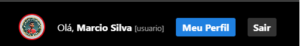

**2. Avatar Integrado ao Cabeçalho Global:**
*Demonstra a aplicação do padrão BFF no carregamento de mídia, onde a miniatura do perfil é renderizada na página de catálogo atestando a conexão do FastAPI com o Object Storage.*
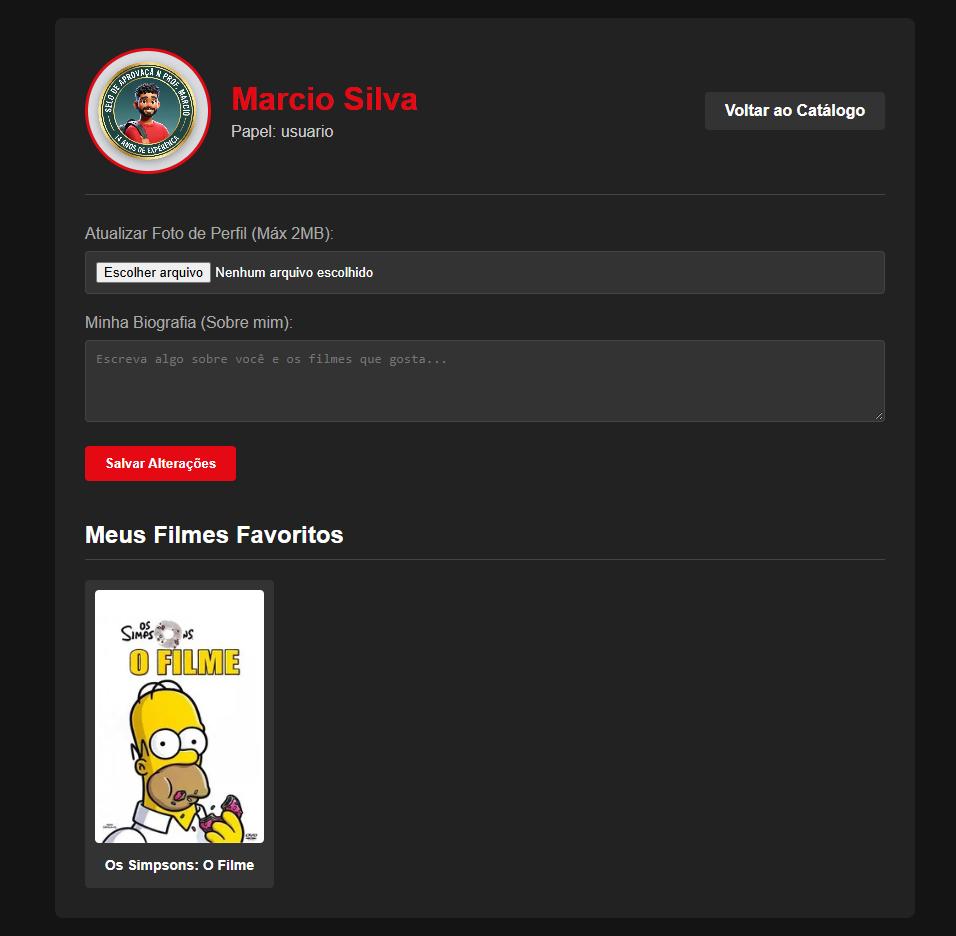
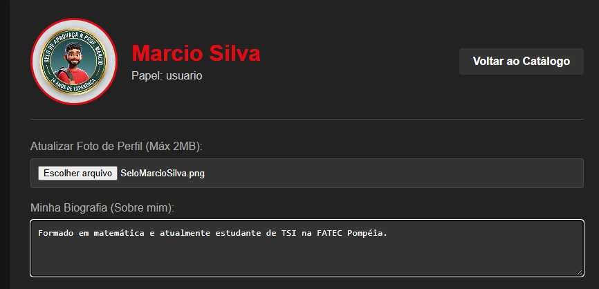

**Arquitetura final de microsserviços em execução no Portainer:**
*Consolidação de todas as atividades propostas até o presente momento, com a evidência da criação de todos os containeres utilizados para a execução da atividade proposta no TomFlix.*
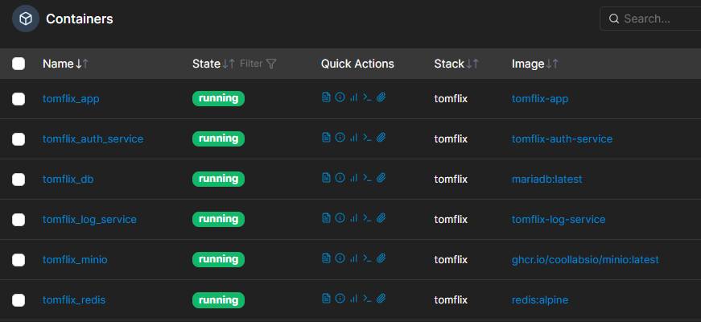
---
*Desenvolvido por Marcio Hernani - Estudante de Tecnologia em Sistemas Inteligentes*
---
*Disciplina: Computação em Nuvem - Professor Me. Allan L. R. Siriani* - (@siriani).
